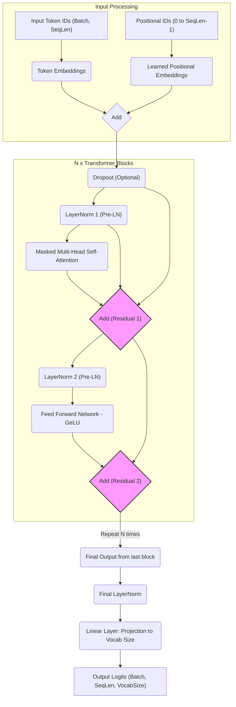

# Pointers

<u>_generated by Gemini 2.5_</u>

Implementing GPT-2 involves these main modifications:

- Decoder-Only: You only need the decoder stack. There's no encoder and therefore no cross-attention mechanism.
- Positional Encoding: GPT-2 uses learned absolute positional embeddings instead of fixed sinusoidal ones.
- Normalization Placement: GPT-2 uses Pre-Layer Normalization. LayerNorm is applied before the sub-layers (Attention, FFN), unlike the original's Post-LayerNorm.
- Activation Function: GPT-2 uses GeLU (Gaussian Error Linear Unit) in the Feed-Forward Network instead of ReLU.
- Initialization: GPT-2 employed a specific weight initialization scheme, crucial for stable training of deep models.
- Vocabulary/Embeddings: GPT-2 used a specific BPE tokenizer and vocabulary (50257 tokens). The final output layer often shares weights with the input token embedding layer.

Let's break down the architecture step-by-step, focusing on the data flow for a single forward pass:

### Conceptual Diagram Analogy (Text-Based)

Imagine the data (x) flowing upwards. Compare this to the decoder part of the original Transformer diagram:

### Step-by-Step Implementation Guide:

1. Input Embeddings & Positional Embeddings:

- Input: A sequence of token IDs (e.g., [batch_size, sequence_length]).
- Token Embeddings (wte): Create an embedding layer (torch.nn.Embedding) that maps token IDs to dense vectors of size d_model (hidden dimension, e.g., 768 for GPT-2 small). Output shape: [batch_size, sequence_length, d_model].
- Learned Positional Embeddings (wpe): Create a second embedding layer (torch.nn.Embedding). This layer takes positional indices (from 0 to sequence_length - 1) as input. Its size should be [max_position, d_model], where max_position is the maximum sequence length the model can handle (e.g., 1024 for GPT-2). Lookup the embeddings for the positions in the current sequence. Output shape: [batch_size, sequence_length, d_model] (you'll need to handle the batch dimension, often by repeating or broadcasting the [sequence_length, d_model] positional embeddings).
- Combine: Add the token embeddings and positional embeddings element-wise. Input = TokenEmbeddings + PositionalEmbeddings.
- (Optional Dropout): Apply dropout to the combined embeddings.

2. Transformer Block (Repeated N times):

- This is the core unit. Let the input to the block be x.
- Pre-Layer Normalization 1: Apply Layer Normalization before the self-attention layer. ln1_out = LayerNorm1(x).
- Masked Multi-Head Self-Attention:
    - Use ln1_out to compute Queries (Q), Keys (K), and Values (V) via linear projections, just like the original Transformer.
    - Apply Scaled Dot-Product Attention: Attention(Q, K, V) = softmax( (Q @ K.T) / sqrt(d_k) + mask ) @ V.
    - Crucially: Apply the causal (look-ahead) mask. This mask ensures that a token at position i can only attend to tokens at positions <= i. It's usually implemented by adding negative infinity (-inf) to the attention scores corresponding to future positions before the softmax. This is identical to the masked self-attention in the original Transformer's decoder.
- Project the concatenated heads back to d_model using a final linear layer.
- (Optional Dropout): Apply dropout to the attention output. Let the result be attn_output.
- Residual Connection 1: Add the attention output back to the original input of the block: x = x + attn_output.
- Pre-Layer Normalization 2: Apply another Layer Normalization to the result of the first residual connection. ln2_out = LayerNorm2(x).
- Feed-Forward Network (FFN):
    - Apply the first linear layer to expand d_model to an intermediate size (usually 4 * d_model). ffn_hidden = Linear1(ln2_out).
    - Apply the GeLU activation function: ffn_activated = GeLU(ffn_hidden).
    - Apply the second linear layer to project back to d_model. ffn_output = Linear2(ffn_activated).
    - (Optional Dropout): Apply dropout to the FFN output.
- Residual Connection 2: Add the FFN output back to the input of the second LayerNorm: x = x + ffn_output.
- The output x of this step becomes the input to the next Transformer block.

3. Stacking: Repeat Step 2 N times (e.g., N=12 for GPT-2 small, N=24 for medium, etc.). The output of one block feeds into the next.

4. Final Layer Normalization: After the last Transformer block, apply one final Layer Normalization to the output. final_output = FinalLayerNorm(x).

5. Output Linear Layer (LM Head):

- Apply a linear layer to project the final output from d_model to the vocabulary size (vocab_size, e.g., 50257). logits = OutputLinear(final_output).
- Output shape: [batch_size, sequence_length, vocab_size]. These logits represent the model's prediction for the next token at each position in the sequence.
- Weight Tying (Optional but common): The weights of this final linear layer are often tied (shared) with the weights of the input token embedding layer (wte). This saves parameters and can improve performance. In PyTorch, you can achieve this by setting OutputLinear.weight = TokenEmbedding.weight.

### Key Implementation Pointers:

- Causal Mask: Ensure your attention mask correctly prevents attending to future tokens. It's a lower triangular matrix of scores (or an upper triangular mask of -inf).
- GeLU: Implement the GeLU function or use the one provided by your framework (e.g., torch.nn.GELU).
- Pre-Normalization: Make sure LayerNorm is applied before the attention and FFN modules within the residual path (x + SubLayer(LayerNorm(x))).
- Learned Positional Embeddings: Treat it as a standard embedding lookup based on position indices. Remember the maximum context length (max_position).
- Configuration: GPT-2 comes in different sizes (small, medium, large, XL) which vary d_model, number of layers (N), and number of attention heads. Choose one configuration (e.g., small: 12 layers, 768 hidden size, 12 heads) to start.
- Initialization: If training from scratch, look up the specific initialization recommended in the GPT-2 paper (scaling standard deviation by 1/sqrt(N) for residual projections). If just implementing the architecture, standard initialization might suffice for verifying structure.