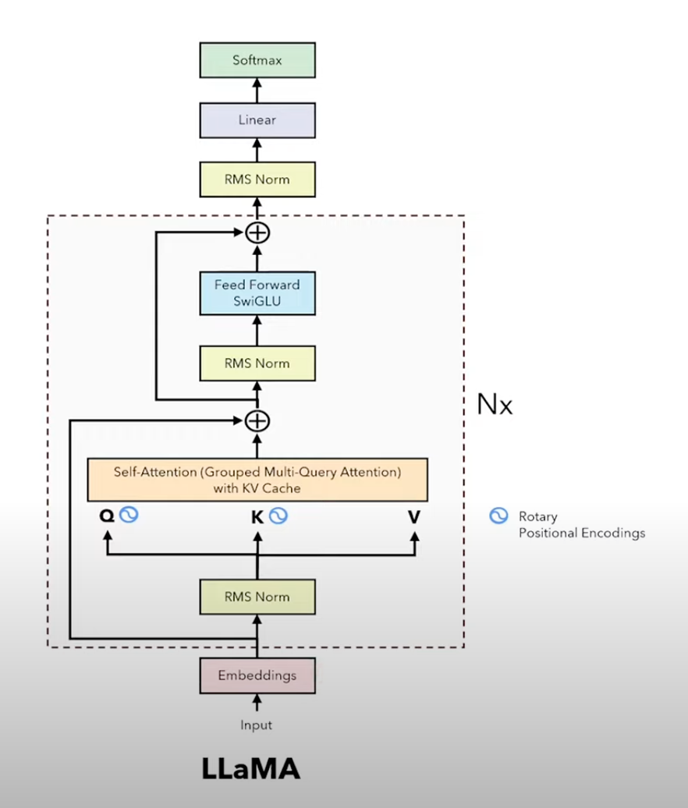

# Llama2 Flow

Screenshot from [Umar Jamil's video](https://youtu.be/Mn_9W1nCFLo?si=V32nIRxm11vciUbt&t=145)

## Assumptions

- `batch_size`: Number of sequences processed in parallel.
- `seq_len`: Length of the input sequence.
- `hidden_dim`: The main dimensionality of the model embeddings (e.g., `4096` for Llama 2 7B). Note: this is exactly the same as the `d_model` in the original Transformer paper. I can think of this as the modern term for this fundamental parameter.
- `num_layers`: Number of stacked Transformer blocks.
- `num_heads`: Number of attention heads.
- `head_dim`: Dimension of each attention head (`hidden_dim / num_heads`).
- `ffn_dim`: Intermediate dimension in the FeedForward network (often larger than `hidden_dim`). Similar to the `d_ff` in the original Transformer paper that had a dimension of `4 * d_model`.
- `vocab_size`: Size of the tokenizer vocabulary.

## Overall Structure

- Input Embedding
- Stacked Transformer Blocks (`num_layers` times)
- Final Normalization
- Language Model Head (Output Projection)

## Detailed Flow

### Phase 0: Precomputation (Done Once)

- Compute RoPE Frequencies: Calculate the cos and sin values needed for Rotary Positional Embedding (RoPE) for all potential positions up to a maximum sequence length and for all relevant dimensions (`head_dim`). These depend only on position and dimension index, not on the input data. Store these `cos_cached`, `sin_cached` tensors.

### Phase 1: Input Processing

#### A. Input Token IDs:

- Start with input sequence represented as token IDs.
- Shape: `[batch_size, seq_len]`

#### B. Token Embedding:

- Convert token IDs into dense vectors using an embedding layer.
- Component: `nn.Embedding(vocab_size, hidden_dim)`
- Input Shape: `[batch_size, seq_len]`
- Output Shape: `[batch_size, seq_len, hidden_dim]`
- Let's call this output `x`.

### Phase 2: Transformer Blocks (Repeated `num_layers` times)

The output `x` from the previous layer (or Phase 1 for the first layer) becomes the input to the current layer.

Inside ONE Transformer Block:

#### A. Self-Attention Sub-Layer:

A1. Pre-Normalization (RMSNorm): Apply Root Mean Square Normalization to the input `x`.

- Component: `RMSNorm(hidden_dim)`
- Input Shape: `[batch_size, seq_len, hidden_dim]`
- Output Shape: `[batch_size, seq_len, hidden_dim]`
- Let's call this `norm_x`.

A2. Calculate Q, K, V: Project `norm_x` using three separate linear layers to get Query, Key, and Value matrices.

- Components: `nn.Linear(hidden_dim, hidden_dim)` for Q, K, V (total 3 layers).
- Input Shape: `[batch_size, seq_len, hidden_dim]` (for each projection)
- Output Shapes (Q, K, V): `[batch_size, seq_len, hidden_dim]`

A3. Reshape for Multi-Head: Split the hidden_dim dimension into `num_heads` and `head_dim`. Transpose to prepare for attention calculation.

- Operation: Reshape & Transpose
- Input Shapes (Q, K, V): `[batch_size, seq_len, hidden_dim]`
- Output Shapes (Q, K, V): `[batch_size, num_heads, seq_len, head_dim]`

A4. Apply Rotary Positional Embedding (RoPE): Modify the Q and K tensors using the precomputed RoPE frequencies based on token positions.

- Component: RoPE application function (using `cos_cached`, `sin_cached`).
- Input Shapes (Q, K): `[batch_size, num_heads, seq_len, head_dim]`
- Output Shapes (Q_rotated, K_rotated): `[batch_size, num_heads, seq_len, head_dim]`
- Note: V is not rotated.
- Position Handling: During training/full sequence processing, use positions 0 to seq_len-1. During inference with KV cache, use the absolute position index for the current token(s) being processed.

A5. KV Caching (Inference Only):

- If generating token by token and a past_key_value cache exists for this layer:
  - Retrieve past_k, past_v from the cache.
  - Concatenate K_rotated (current step) with past_k along the sequence length dimension (dim=2).
    - Concatenate V (current step) with past_v along the sequence length dimension (dim=2).
    - Store the newly concatenated K and V as the current_key_value for the next step's cache.
  - If training or processing the initial prompt:
    - The K and V to be used in attention are simply `K_rotated` and `V` from steps 4 & 2.
    - If KV caching will be used later (i.e., processing a prompt before generation), store `K_rotated` and `V` as the initial `current_key_value`.
    - Let the K and V used for attention be `K_attention` and `V_attention` (these might be cached+current or just current).

A6. Scaled Dot-Product Attention: Compute attention scores and output.

- Operation: Attention(Q, K, V) = softmax(Q @ K^T / sqrt(head_dim)) @ V (potentially using optimized kernels like FlashAttention).
- Input Shapes: Q_rotated ([b, h, s_q, d]), K_attention ([b, h, s_kv, d]), V_attention ([b, h, s_kv, d]). Note: s_q is the query sequence length (often 1 during generation), s_kv is the key/value sequence length (grows during generation).
- Output Shape: [batch_size, num_heads, seq_len, head_dim] (where seq_len matches the query length s_q).

A7. Reshape and Concatenate Heads: Combine the results from all heads back into the hidden_dim.

- Operation: Transpose & Reshape
- Input Shape: [batch_size, num_heads, seq_len, head_dim]
- Output Shape: [batch_size, seq_len, hidden_dim]

A8. Output Projection: Apply a final linear layer within the attention block.

- Component: nn.Linear(hidden_dim, hidden_dim)
- Input Shape: [batch_size, seq_len, hidden_dim]
- Output Shape: [batch_size, seq_len, hidden_dim]
- Let's call this `attn_output`.

#### B. First Residual Connection:

- Add the output of the attention block (`attn_output`) to the original input `x` of the Transformer block.
- Operation: `x = x + attn_output`
- Input Shapes: Both `[batch_size, seq_len, hidden_dim]`
- Output Shape: `[batch_size, seq_len, hidden_dim]`

#### C. Feed-Forward Sub-Layer (SwiGLU):

C1. Pre-Normalization (RMSNorm): Apply RMSNorm to the result of the first residual connection.

- Component: `RMSNorm(hidden_dim)`
- Input Shape: `[batch_size, seq_len, hidden_dim]`
- Output Shape: `[batch_size, seq_len, hidden_dim]`
- Let's call this `norm_residual`.

C2. Calculate Gate and Up Projections: Apply two separate linear layers to project `norm_residual` to the intermediate `ffn_dim`.

- Components: `nn.Linear(hidden_dim, ffn_dim)` (for Gate), `nn.Linear(hidden_dim, ffn_dim)` (for Up).
- Input Shape: `[batch_size, seq_len, hidden_dim]`
- Output Shapes (Gate proj, Up proj): `[batch_size, seq_len, ffn_dim]`

C3. Apply Swish (SiLU) to Gate: Apply the Swish activation function element-wise to the gate projection.

- Component: `nn.SiLU()`
- Input Shape: `[batch_size, seq_len, ffn_dim]`
- Output Shape (Activated Gate): `[batch_size, seq_len, ffn_dim]`

C4. Element-wise Multiplication: Multiply the activated gate by the up projection.

- Operation: `gated_output = Activated_Gate * Up_proj`
- Input Shapes: Both `[batch_size, seq_len, ffn_dim]`
- Output Shape: `[batch_size, seq_len, ffn_dim]`

C5. Down Projection: Project the result back down to hidden_dim.

- Component: `nn.Linear(ffn_dim, hidden_dim)`
- Input Shape: `[batch_size, seq_len, ffn_dim]`
- Output Shape: `[batch_size, seq_len, hidden_dim]`
- Let's call this `ffn_output`.

#### D. Second Residual Connection:

Add the output of the feed-forward block (`ffn_output`) to the input of the feed-forward block (the result from the first residual connection).

- Operation: `x = x + ffn_output` (Note: the `x` here is the one from step B.1)
- Input Shapes: Both `[batch_size, seq_len, hidden_dim]`
- Output Shape: `[batch_size, seq_len, hidden_dim]`

End of Block: The output `x` from step D.1 is the final output of this Transformer block. It becomes the input for the next block.

### Phase 3: Final Output

#### A. Final Normalization:

- After the last Transformer block, apply one final RMSNorm.
- Component: `RMSNorm(hidden_dim)`
- Input Shape: `[batch_size, seq_len, hidden_dim]` (Output from the last block)
- Output Shape: `[batch_size, seq_len, hidden_dim]`

#### B. Language Model Head:

- Apply a linear layer to project the normalized hidden states to vocabulary logits.

- Component: `nn.Linear(hidden_dim, vocab_size)` (Weights might be tied to the input embedding layer).
- Input Shape: `[batch_size, seq_len, hidden_dim]`
- Output Shape: `[batch_size, seq_len, vocab_size]`
- Result: The output tensor contains the logits for each token position in the sequence. During generation, we'd typically focus on the logits for the last token position ([:, -1, :]) to predict the next token.

---

<a href="./README.md">Go Back to README</a>